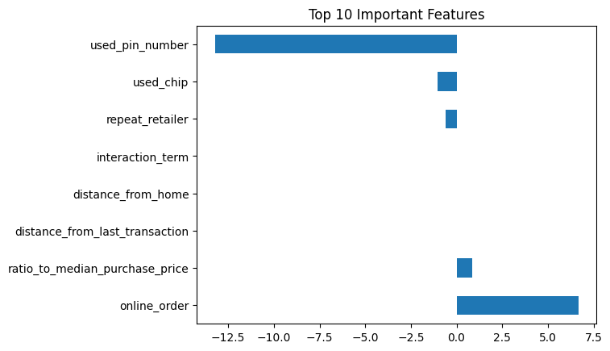
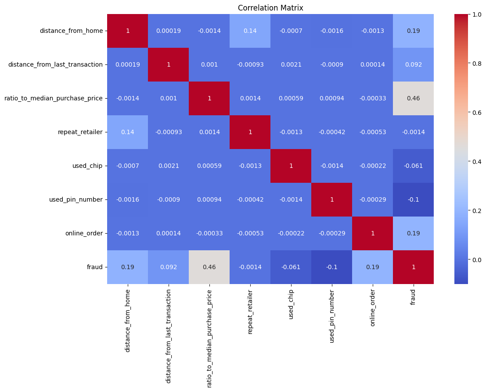

# Credit Card Fraud Detection with Feature Selection and Predictive Modeling

## Overview

This project analyzes a dataset containing 1,000,000 credit card transactions, 8.7% of which are labeled as fraudulent. The primary objective is to predict fraud by analyzing transaction patterns and behaviors, engineering features that enhance detection, and utilizing various machine learning models for classification. I also explore the relationship between key features like transaction proximity, purchase ratios, and transaction security measures.

## Objectives

- Detect fraudulent transactions using multiple machine learning models.
- Engineer key features to improve the prediction of fraudulent behavior.
- Visualize insights related to fraud detection patterns.
- Assess the correlation between transaction characteristics and fraudulent activity.

## Tools

- **Google Colab**
- **Python** (Pandas, Scikit-learn, Matplotlib, Seaborn, NumPy)
- **Classification Models**: Logistic Regression, Decision Tree, Random Forest, K-Nearest Neighbors (KNN)

## Data

The dataset contains various features related to each transaction:
- **distance_from_home**: Distance between the cardholder’s home and the transaction location.
- **distance_from_last_transaction**: Distance from the previous transaction.
- **ratio_to_median_purchase_price**: The ratio of the transaction amount to the median purchase price for the cardholder.
- **repeat_retailer**: Indicator of whether the cardholder has made previous transactions at the same retailer.
- **used_chip**, **used_pin_number**, **online_order**: Binary indicators reflecting transaction security.

## Journey

1. **Data Preprocessing**:
   - Cleaned and filtered the dataset for consistency.
   - Engineered new features to enhance model performance.

2. **Feature Engineering**:
   - **Transaction Proximity**:
     - Calculated by summing the distances from the cardholder’s home and the previous transaction.
       ```python
       def transaction_proximity(data):
           data['transaction_proximity'] = data['distance_from_home'] + data['distance_from_last_transaction']
           return data
       ```

   - **Purchase Ratio Scaled**:
     - Created by scaling the ratio of the transaction price to the median purchase price.
       ```python
       def purchase_ratio_scaled(data):
           data['purchase_ratio_scaled'] = data['ratio_to_median_purchase_price'] / data['ratio_to_median_purchase_price'].median()
           return data
       ```

   - **Fraud Probability**:
     - A weighted score based on transaction behavior (repeat retailer, chip usage, online order, PIN number usage).
       ```python
       def fraud_probability(data):
           data['fraud_probability'] = (
               0.4 * data['repeat_retailer'] +
               0.2 * data['used_chip'] +
               0.2 * data['online_order'] +
               0.2 * data['used_pin_number']
           )
           return data
       ```

3. **Machine Learning Models**:
   - **Logistic Regression**: A linear model to classify transactions as fraudulent or non-fraudulent.
   - **Decision Tree**: A tree-based model to segment the data and classify transactions.
   - **Random Forest**: An ensemble of decision trees for more accurate predictions.
   - **K-Nearest Neighbors (KNN)**: A model that classifies based on the closest data points.

4. **Visualizations**:
   - Histogram of **fraud scores**, revealing that a fraud score of **70** had the highest frequency.
   - Plots illustrating the relationship between approval/rejection metrics and fraud likelihood.
   - Correlation matrix indicating which features are closely related to fraudulent transactions. 

## Insights

1. **Fraud Score**:
   - The most frequent fraud score was **70**, indicating this was a critical threshold for identifying fraudulent transactions.
   - Fraud score thresholds were based on the **25th** and **75th percentiles**.

2. **Rejection and Approval Rates**:
   - **Rejection Rates** for features such as **transaction proximity**, **purchase ratio**, **fraud probability**, and **chip used** were consistent at **362,888**.
   - **Approval Rates** for the same features were **275,180**.

3. **Fraudulent vs. Non-Fraudulent Transactions**:
   - The dataset contained **912,597** fraudulent and **87,403** non-fraudulent transactions.

4. **Correlation**:
   - **Transaction proximity** had the highest correlation with fraud, indicating that transactions farther from the cardholder’s home or previous location were more likely to be fraudulent.
   - **Used chip, used pin number, and online order** had the lowest correlation, suggesting that these security features alone did not strongly indicate fraud.

## Results

1. **Model Performance**:
   - **Logistic Regression**: Accuracy of **0.9347**.
   - **Decision Tree**: Accuracy of **0.9969**.
   - **Random Forest**: Accuracy of **0.9969**.
   - **K-Nearest Neighbors**: Accuracy of **0.9960**.

2. **Key Features**:
   - **Transaction proximity** and **purchase ratio** were the most influential predictors of fraud.
   - **Fraud probability**, based on transaction behavior indicators, effectively highlighted fraudulent transactions.

3. **Fraud Insights**:
   - High fraud detection rates were achieved by focusing on **proximity**, with transactions occurring farther from home being more likely to be fraudulent.
   - Security measures such as **chip usage** and **PIN numbers** had minimal impact on predicting fraud.

## Lessons Learned

- **Feature Engineering**: Creating new features like **transaction proximity** and **fraud probability** significantly improved the model’s ability to detect fraud.
- **Data Balance**: The imbalance between fraudulent and non-fraudulent transactions was effectively handled through feature engineering and careful model selection.

## Instructions

1. Clone the repository.
2. Navigate to the project directory.
3. Install the required libraries:
   ```bash
   pip install pandas scikit-learn matplotlib seaborn

## Visualizations


