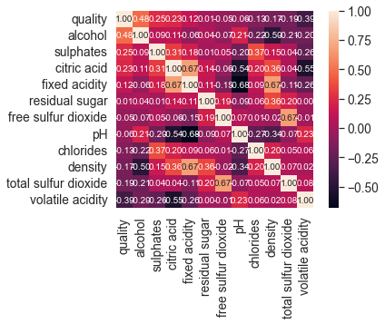
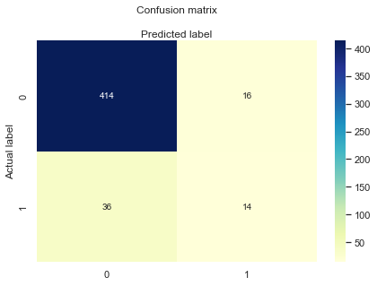

# Red Wine Quality Analysis

## The Story

In the world of wine, quality is king. But what truly makes a wine exceptional? This project dives into the data behind Vinho Verde red wine, seeking to unravel the mystery of what makes one bottle better than another.

## Objectives
- Uncover the key factors influencing wine quality.
- Visualize the journey from grape to glass.
- Build predictive models to estimate wine quality, offering a data-driven approach to winemaking.

## Tools
- Python (Pandas, NumPy, Matplotlib, Seaborn, Scikit-learn)

## The Journey

### Data Exploration and Cleaning
I started by exploring the dataset, cleaning it to ensure analysis was based on accurate and reliable data. Understanding the distribution of each feature was crucial to identifying outliers and trends.

### Visual Insights
Through visualizations, I painted a picture of the wine's physicochemical properties, highlighting the characteristics of high and low-quality wines. These visual stories provided insights into the winemaking process.

### Predictive Modeling
By training predictive models, I aimed to predict wine quality with an accuracy that could revolutionize the quality control process in winemaking.

## Results
- Significant features influencing wine quality identified.
- Predictive models achieved up to 80% accuracy.
- Detailed visualizations and insights provided.

## Instructions
1. Clone the repository.
2. Navigate to the `Red-Wine-Quality-Analysis` directory.
3. Run the scripts in the `scripts` folder to replicate the analysis.

## Visualizations
 (./visualizations/correlation2_rw.png)

